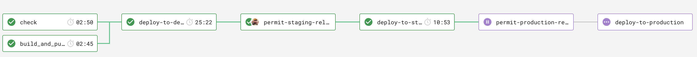

# Evidence API

Evidence API is a Platform API to allow services to request and upload evidence from members of the borough.

## Stack

-   .NET Core as a web framework.
-   nUnit as a test framework.

## What does it do?

[**🚀 Swagger**](https://app.swaggerhub.com/apis-docs/Hackney/evidence-api/1.0.0) ([Edit it here](https://app.swaggerhub.com/apis/Hackney/evidence-api/1.0.0))

## Context and history

See the [Architectural Decision Log](/docs/adr).

## Contributing

### Setup

1. Install [Docker][docker-download].
2. Install [AWS CLI][aws-cli].
3. Clone this repository.
4. Rename the initial template.
5. Open it in your IDE.

### Development

Build and serve the application. It will be available in the port 5000.

```sh
$ make build && make serve
```

#### Database Things

To modify the database schema:

_Prerequsite: Make sure you have your database running—something like `docker-compose up -d dev-database`_

1. Create or edit the `entity` files corresponding to the models you want to modify
2. Run `bin/dotnet ef --project EvidenceApi migrations add NameOfMigration`  substituting the name of the migration
3. Check the migration to make sure it does what you want (and not other things)—it can be found in `EvidenceApi/Migrations`
4.
    - If the migration looks good, run `bin/dotnet ef --project EvidenceApi database update`  to run the migrations
    - If the migration looks bad, run `bin/dotnet ef --project EvidenceApi migrations remove` to wipe the migration

### Release process

We use a pull request workflow, where changes are made on a branch and approved by one or more other maintainers before the developer can merge into `master` branch.



Then we have an automated six step deployment process, which runs in CircleCI.

1. Automated tests (nUnit) are run to ensure the release is of good quality.
2. The application is deployed to development automatically, where we check our latest changes work well.
3. We manually confirm a staging deployment in the CircleCI workflow once we're happy with our changes in development.
4. The application is deployed to staging.
5. We manually confirm a production deployment in the CircleCI workflow once we're happy with our changes in staging.
6. The application is deployed to production.

Our staging and production environments are hosted by AWS. We would deploy to production per each feature/config merged into `master` branch.

### Creating A PR

To help with making changes to code easier to understand when being reviewed, we've added a PR template.
When a new PR is created on a repo that uses this API template, the PR template will automatically fill in the `Open a pull request` description textbox.
The PR author can edit and change the PR description using the template as a guide.

## Static Code Analysis

### Using [FxCop Analysers](https://www.nuget.org/packages/Microsoft.CodeAnalysis.FxCopAnalyzers)

FxCop runs code analysis when the Solution is built.

Both the API and Test projects have been set up to **treat all warnings from the code analysis as errors** and therefore, fail the build.

However, we can select which errors to suppress by setting the severity of the responsible rule to none, e.g `dotnet_analyzer_diagnostic.<Category-or-RuleId>.severity = none`, within the `.editorconfig` file.
Documentation on how to do this can be found [here](https://docs.microsoft.com/en-us/visualstudio/code-quality/use-roslyn-analyzers?view=vs-2019).

## Testing

### Run the tests

```sh
$ make test
```

To run database tests locally (e.g. via Visual Studio) the `CONNECTION_STRING` environment variable will need to be populated with:

`Host=localhost;Database=testdb;Username=postgres;Password=mypassword"`

Note: The Host name needs to be the name of the stub database docker-compose service, in order to run tests via Docker.

If changes to the database schema are made then the docker image for the database will have to be removed and recreated. The restart-db make command will do this for you.

### Agreed Testing Approach

-   Use nUnit, FluentAssertions and Moq
-   Always follow a TDD approach
-   Tests should be independent of each other
-   Gateway tests should interact with a real test instance of the database
-   Test coverage should never go down
-   All use cases should be covered by E2E tests
-   Optimise when test run speed starts to hinder development
-   Unit tests and E2E tests should run in CI
-   Test database schemas should match up with production database schema
-   Have integration tests which test from the PostgreSQL database to API Gateway

## Data Migrations

### A good data migration

-   Record failure logs
-   Automated
-   Reliable
-   As close to real time as possible
-   Observable monitoring in place
-   Should not affect any existing databases

## Contacts

### Active Maintainers

-   **Selwyn Preston**, Lead Developer at London Borough of Hackney (selwyn.preston@hackney.gov.uk)
-   **Mirela Georgieva**, Lead Developer at London Borough of Hackney (mirela.georgieva@hackney.gov.uk)
-   **Matt Keyworth**, Lead Developer at London Borough of Hackney (matthew.keyworth@hackney.gov.uk)

### Contributors

-   **Sam Garson**, Senior Engineer at Made Tech (sam.garson@hackney.gov.uk)
-   **Bogdan Zaharia**, Engineer at Made Tech (bogdan.zaharia@hackney.gov.uk)

### Other Contacts

-   **Rashmi Shetty**, Product Owner at London Borough of Hackney (rashmi.shetty@hackney.gov.uk)

[docker-download]: https://www.docker.com/products/docker-desktop
[universal-housing-simulator]: https://github.com/LBHackney-IT/lbh-universal-housing-simulator
[made-tech]: https://madetech.com/
[aws-cli]: https://aws.amazon.com/cli/
