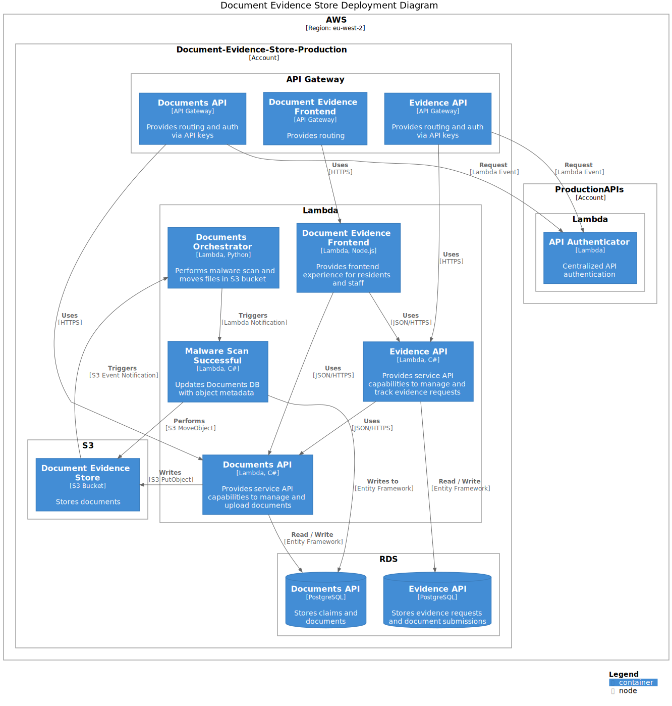
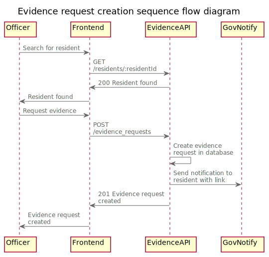
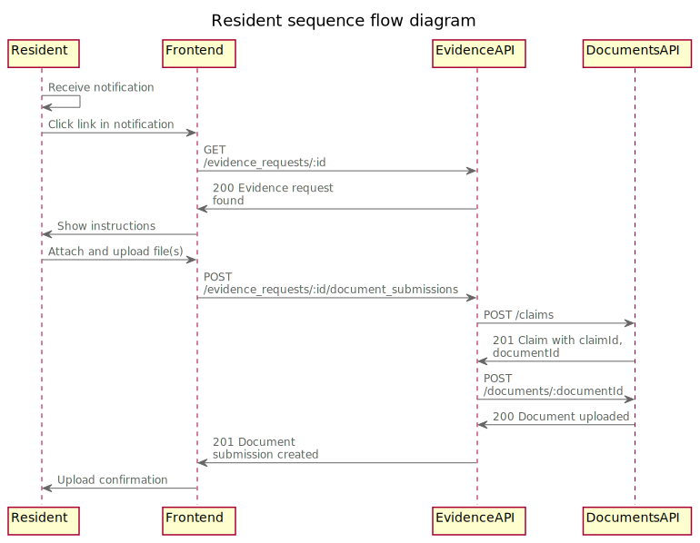
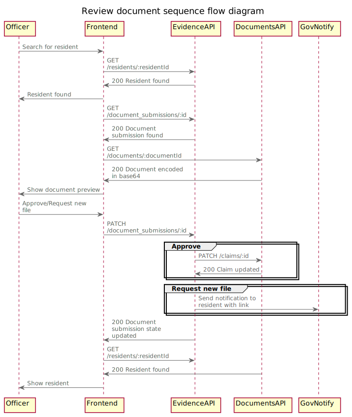

# Document Evidence Store Diagrams

- [C4 Diagrams](#c4-diagrams)
- [Sequence Flow Diagrams](#sequence-flow-diagrams)

Following [Social Care Architecture](https://github.com/LBHackney-IT/social-care-architecture) who use PlantUML to construct diagrams

To create _svg_ representation of diagrams:
1. Install [PlantUML extension](https://marketplace.visualstudio.com/items?itemName=jebbs.plantuml) for Visual Studio Code
   - Extension settings are defined in .vscode/settings.json
2. Navigate to the `iuml` file you wish to export
3. Run the PlantUML action _Export Current File Diagrams_
4. Click _svg_
5. Find the exported diagram under `out/docs/diagrams`
6. Copy it into this directory

## C4 Diagrams

### Context Diagram

The [context diagram](https://c4model.com/#SystemContextDiagram) shows the highest level of the system. It depicts the key users and systems.

### Container Diagram

The [container diagram](https://c4model.com/#ContainerDiagram) shows the interacting systems within the system.

### Deployment Diagram

The [deployment diagram](https://c4model.com/#DeploymentDiagram) shows the key aspects of the deployed system in AWS.

## Sequence Flow Diagrams

### Document Upload

### Document Retrieval

### Evidence request creation

### Resident

### Review Document

