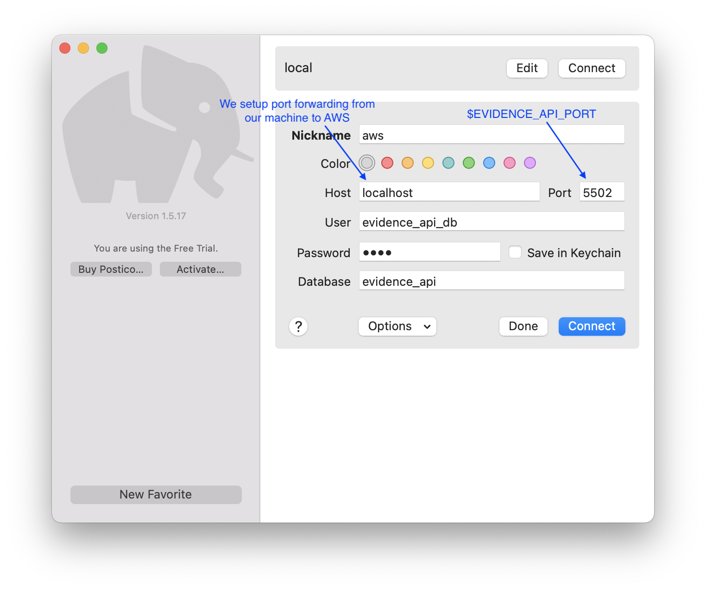

# Tracking requests through environments

-   This is documentation for how to track requests through the staging environment.
-   Hopefully it will prove handy lookup for seasoned developers and folks new to the codebase.
-   Decided to put it in the `EvidenceAPI` code base but it also covers [document-evidence-store-frontend](https://github.com/LBHackney-IT/document-evidence-store-frontend) and [
   documents-api](https://github.com/LBHackney-IT/documents-api).

## Resources

### Database

Our databases (evidence-api, documents-api) sit behind an AWS VPC and are not exposed to the Internet so there are a few steps we need to do before being able to connect to them from our local machine.

#### Prerequisites

🚨 (this was written for Mac/Linux)

1. [AWS CLI](https://docs.aws.amazon.com/cli/latest/userguide/cli-chap-welcome.html)
2. [AWS Session Manager](https://docs.aws.amazon.com/systems-manager/latest/userguide/session-manager-working-with-install-plugin.html#install-plugin-macos)
3. Access to Hackney AWS (speak to the HackIT for this)
4. Postgres client - [Postico](https://eggerapps.at/postico/) is free and simple to use

#### Steps

This was written for the EvidenceAPI staging database and the steps can be easily changed for the DocumentsAPI or production instances

1. Navigate to the [Hackney AWS start page](https://hackney.awsapps.com/start#/)
2. Select _StagingAPIs_ domain
3. Click on _Command line or programmatic access_
4. Option 1 lets you copy the values to AWS environment variables, click the box to copy
5. Paste these into your terminal
6. Again in your terminal, run
```sh
aws configure set aws_access_key_id $AWS_ACCESS_KEY_ID
aws configure set aws_secret_access_key $AWS_SECRET_ACCESS_KEY
```
7. Next run the following to create a private key and permission it appropriately
```sh
aws ssm get-parameter --name "/document-evidence-store-staging-jump-box-pem-key	" --output text --query Parameter.Value > ./private-key.pem
chmod 400 ./private-key.pem
```
8. Create environment variables by retrieving properties from AWS SSM
```sh
EVIDENCE_API_HOST=$(aws ssm get-parameter --name /evidence-api/staging/postgres-hostname --query Parameter.Value)
EVIDENCE_API_PORT=$(aws ssm get-parameter --name /evidence-api/staging/postgres-port --query Parameter.Value)
JUMP_BOX_NAME=$(aws ssm get-parameter --name /document-evidence-store-staging-jump-box-instance-name --query Parameter.Value)
```
9. Setup port forwarding which creates a tunnel between your local machine and the EvidenceAPI database. It will map `localhost:EVIDENCE_API_PORT` to `aws_host:EVIDENCE_API_PORT`
```sh
ssh -4 -i ./private-key.pem -Nf -M -L ${EVIDENCE_API_PORT//\"}:${EVIDENCE_API_HOST//\"}:${EVIDENCE_API_PORT//\"} -o "UserKnownHostsFile=/dev/null" -o "StrictHostKeyChecking=no" -o ProxyCommand="aws ssm start-session --target %h --document AWS-StartSSHSession --parameters portNumber=%p --region=eu-west-2" ec2-user@${JUMP_BOX_NAME//\"}
```
10. Print Evidence API database configuration
```sh
echo $EVIDENCE_API_PORT
aws ssm get-parameter --name /evidence-api/staging/postgres-username --query Parameter.Value
aws ssm get-parameter --name /evidence-api/staging/postgres-password --query Parameter.Value --with-decryption
aws ssm get-parameter --name /evidence-api/staging/postgres-database --query Parameter.Value
```
11. Setup a connection to the database from your favourite SQL tool with the details you just retrieved
    - Here's how it should look in Postico: 

### Logs

#### Prerequisites

1. Access to Hackney AWS (speak to the HackIT for this)

#### Steps

1. Navigate to the [Hackney AWS start page](https://hackney.awsapps.com/start#/)
2. Select _StagingAPIs_ domain
3. Click on _Management Console_
4. Click _Services_ > _Lambda_
5. Search for the function name, for example _evidence-api-staging_
6. Click _Monitor_ > _Logs_
    - Here you will see the recent invocations for the lambda
7. Click _View logs in CloudWatch_
   - Again this shows the log streams for the recent invocations, which is quite useful
8. Click _View in Logs Insights_
   - This will let you search all *logs* for this lambda
9. Update the query to search for the text you're interested in. Here's an example of searching by an evidence request ID
    - Don't forget to adjust the date and time range!
```
fields @timestamp, @message
| sort @timestamp desc
| filter @message like /890bc2e0-63fc-4a7e-9de8-99a3bc2a0ddb/
```
