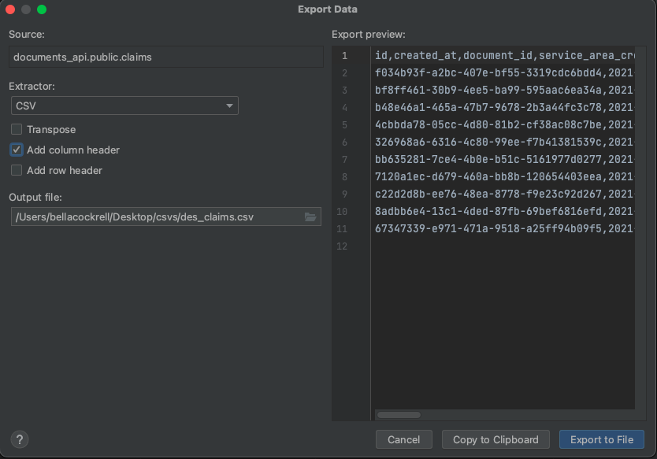

# Manually updating the DES data dashboard

This documentation is to show a developer how to update the data dashboard for DES. This needs o
be done every Thursday in time to release the the weeknotes on Friday morning, as the Qlik
dashboard updates overnight.

## Prerequisites

1. [AWS CLI](https://docs.aws.amazon.com/cli/latest/userguide/cli-chap-welcome.html)
2. [AWS Session Manager](https://docs.aws.amazon.com/systems-manager/latest/userguide/session-manager-working-with-install-plugin.html#install-plugin-macos)
3. Access to Hackney AWS (speak to the HackIT for this)
4. Postgres client - [Postico](https://eggerapps.at/postico/) is free and simple to use. If you have a JetBrains licence, DataGrip is good too.
5. Access to this [Google Shared Drive](https://drive.google.com/drive/folders/12e_kz8U5xLRKIwr-CXjjnn68oavVzTlb) (speak to Huu Do for access)

## Steps

1. Follow the steps listed in [Tracking Requests](tracking-requests.md) to connect to the Evidence API and Documents API **production** databases.
2. Use the Postgres client to select all the data in the tables. In DataGrip, you can just open up a table and all the data is selected. For other clients, you may need to `SELECT * FROM {table_name}`.
3. Export all the tables' data as a CSV.
   1. Make sure to include the column names.
   2. Prepend the file name with `des_`.

4. Once you have downloaded all the CSVs, check that you have the following files:
   1. des_audit_events
   2. des_claims
   3. des_communications
   4. des_document_submissions
   5. des_documents
   6. des_evidence_requests
   7. des_residents
5. Once confirmed, upload and overwrite the files to the Google Drive called `Document Management Service CSV` (listed in [Prerequisites](#prerequisites))
